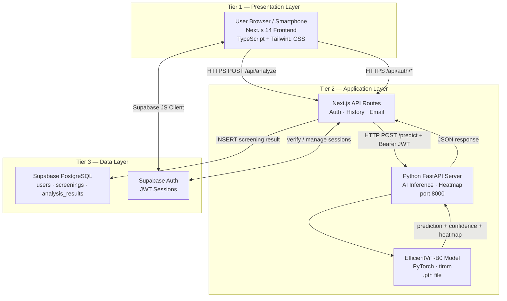
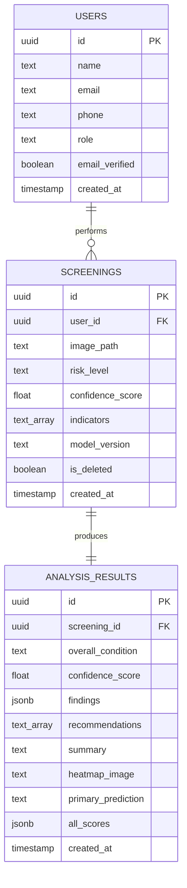
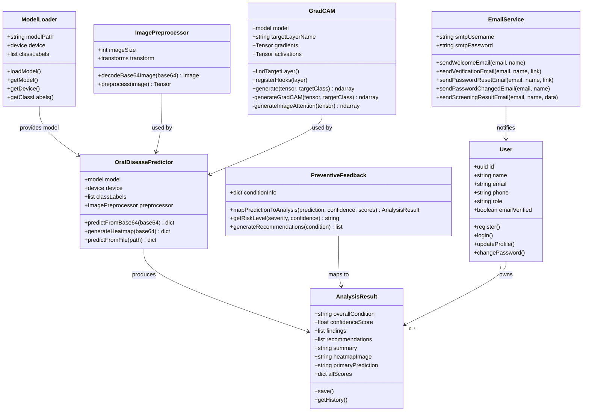
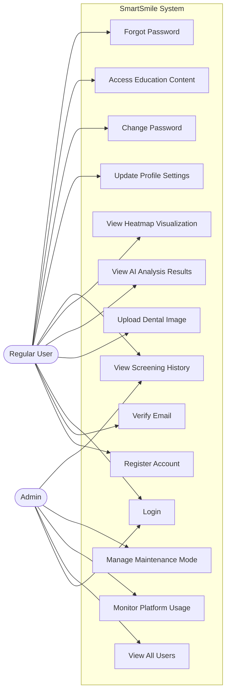
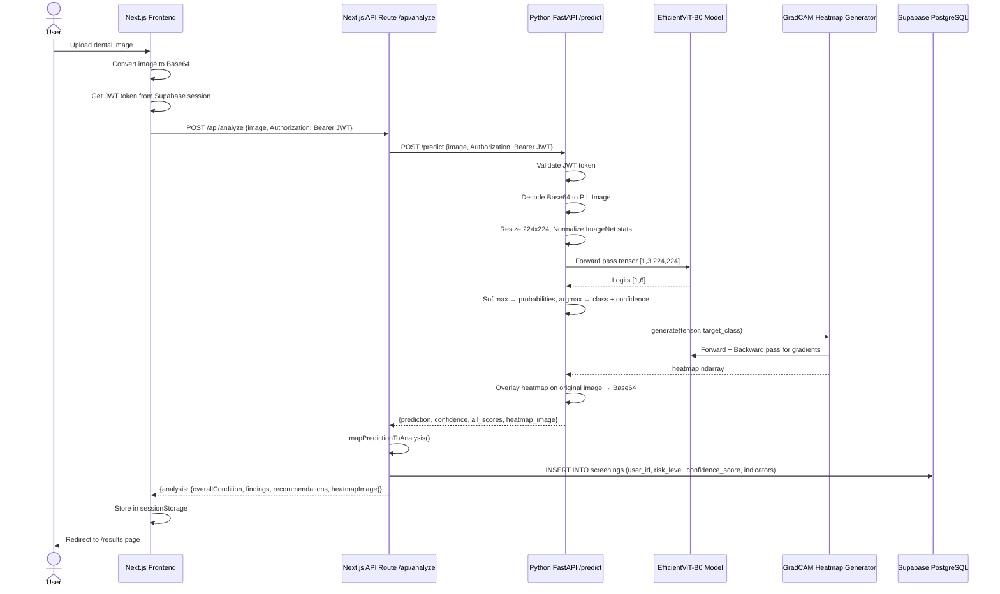

# CHAPTER THREE: SYSTEM ANALYSIS AND DESIGN

## 3.1 Introduction

This chapter presents the system analysis and design strategies used in the creation of the SmartSmile preventive oral health screening system. The chapter describes the methodology used to comprehend user requirements, establish system specifications, and develop a solution that incorporated machine learning with mobile-accessible technology to analyze dental images in real time. A design-oriented research methodology was adopted, involving literature-based analysis and practical system development to address the gap identified in the literature review on available oral health screening tools.

The research was developed through a systematic system development process comprising requirements analysis, system modeling, and iterative design. Principles of user-centered design were applied to ensure that the system was useful and suitable for non-clinical users who took dental pictures with their smartphones. The methodology incorporated both technical and evaluative elements, allowing assessment of the system's functionality, model performance, and preventive relevance. The design choices in this chapter were made to ensure that the proposed system was technically feasible, ethically responsible, and aligned with the preventive goals of the research.

## 3.2 Research Design (Including the SDLC Model Used)

The SmartSmile project adopted an **Agile-Iterative Software Development Life Cycle (SDLC)** model. This approach was selected because it allowed for continuous refinement of both the machine learning model and the web application based on intermediate results and feedback. Rather than following a rigid waterfall sequence, the development proceeded in iterative cycles — each cycle producing a working increment of the system that could be tested and improved.

The Agile-Iterative model was particularly appropriate for this project because:

1. The machine learning component required multiple training and evaluation cycles before achieving acceptable performance.
2. The user interface needed to be refined based on usability feedback.
3. The integration between the Python backend and the Next.js frontend required iterative testing.

The development process followed these phases:
- **Phase 1:** Requirements gathering and literature review (Weeks 1–3)
- **Phase 2:** Dataset collection, preprocessing, and model experimentation (Weeks 2–6)
- **Phase 3:** Model selection, training, and optimization (Weeks 4–7)
- **Phase 4:** Web application development and system integration (Weeks 5–8)
- **Phase 5:** Testing, evaluation, and refinement (Weeks 7–10)
- **Phase 6:** Documentation and final reporting (Weeks 10–12)

### 3.2.1 Dataset and Dataset Description

The dataset used for training the SmartSmile model was a curated collection of dental images sourced from publicly available repositories and research datasets, comprising over 6,000 labeled images across six oral disease categories:

| Class | Description |
|---|---|
| Calculus (Tartar) | Hardened plaque deposits on teeth surfaces |
| Caries (Cavities) | Tooth decay caused by bacterial acid erosion |
| Gingivitis | Inflammation of the gums |
| Hypodontia | Congenital absence of one or more teeth |
| Mouth Ulcer | Painful sores on the oral mucosa |
| Tooth Discoloration | Staining or color changes on tooth surfaces |

The dataset was split into training (70%), validation (15%), and test (15%) sets. All images were resized to 224×224 pixels to match the input requirements of the EfficientViT-B0 architecture. Data augmentation techniques — including random horizontal flipping, rotation (±15°), brightness and contrast adjustment, and random cropping — were applied during training to improve model generalization and reduce overfitting.

The class distribution was approximately balanced across the six categories, with each class containing between 900 and 1,100 images. This balance was important to prevent the model from developing a bias toward more frequently represented classes.

## 3.3 Functional and Non-Functional Requirements

### Functional Requirements

The system was required to fulfill the following functional capabilities:

1. **User Registration and Authentication:** The system must allow users to create accounts with email and password, verify their email address before accessing the dashboard, and log in securely.

2. **Dental Image Upload and Analysis:** The system must allow users to upload or capture dental photographs using their smartphone cameras and submit them for AI analysis.

3. **AI-Powered Condition Detection:** The system must process uploaded images using the trained EfficientViT-B0 model and detect visible indicators of the six oral health conditions.

4. **Results Display:** The system must present analysis results in a clear, understandable format, including the detected condition, confidence score, risk level (Low/Moderate/High), and professional recommendations.

5. **Heatmap Visualization:** The system must generate a Grad-CAM heatmap visualization showing areas of concern in the uploaded dental image.

6. **Screening History:** The system must save analysis results to the user's history and allow users to view all past screening results.

7. **Password Management:** The system must support forgot password and password change functionality via email.

8. **Profile Management:** The system must allow users to update their name, phone number, and account settings.

9. **Admin Panel:** The system must provide an admin-only dashboard for platform management and oversight.

10. **Educational Content:** The system must provide oral health education articles accessible to all users.

### Non-Functional Requirements

1. **Performance:** The system must process and return image analysis results within 5 seconds under normal network conditions.

2. **Accuracy:** The AI model must achieve a minimum accuracy of 85% on the test dataset.

3. **Usability:** The interface must be intuitive for users with no technical or medical background, requiring minimal user input.

4. **Security:** The system must implement secure authentication using JWT tokens, encrypt sensitive data, and restrict admin operations to authorized users only.

5. **Scalability:** The system must be capable of handling multiple concurrent users without significant performance degradation.

6. **Reliability:** The system must maintain an uptime of at least 99% during the evaluation period.

7. **Accessibility:** The system must be accessible on any device with a modern web browser, without requiring installation.

8. **Data Privacy:** The system must comply with basic data protection principles, including limited access and secure storage of health-related data.

### 3.2.1 Proposed System Architecture Diagram

The SmartSmile system architecture followed a three-tier client-server model as illustrated below.

## 3.4 System Architecture

The SmartSmile system was built on a three-tier architecture:

**Tier 1 — Presentation Layer (Frontend):**
The frontend was developed using Next.js 14 with the App Router, TypeScript, and Tailwind CSS. It provided a responsive, mobile-accessible interface that allowed users to upload dental images, view analysis results, manage their profiles, and access educational content. The frontend communicated with both the Next.js API routes and the Python backend.

**Tier 2 — Application Layer (Backend):**
Two backend components handled application logic:
- **Next.js API Routes** handled authentication, user management, email sending, and database interactions via Supabase.
- **Python FastAPI Server** handled all AI inference tasks. It received image uploads, preprocessed them, ran them through the EfficientViT-B0 model, and returned predictions along with Grad-CAM heatmap visualizations.

**Tier 3 — Data Layer:**
Supabase (PostgreSQL) served as the primary database, storing user profiles, screening history, and analysis results. The trained model file (`efficientvit_b0_oral_disease_classifier.pth`) was stored on the backend server.

**Communication Flow:**
1. The user uploads a dental image through the browser.
2. The Next.js frontend sends the image to the Python FastAPI backend via a POST request to `/predict`.
3. The FastAPI server preprocesses the image (resize to 224×224, normalize), runs inference through the EfficientViT-B0 model, and generates a Grad-CAM heatmap.
4. The prediction result (class, confidence, risk level) and heatmap are returned to the frontend.
5. The frontend displays the results and saves them to Supabase via the Next.js API routes.

## 3.5 UML Diagrams

### Entity Relationship Diagram (ERD)

The ERD for the SmartSmile system captured three core entities: Users, Screenings, and Analysis Results. A User can perform many Screenings (one-to-many), and each Screening produces exactly one Analysis Result (one-to-one). This structure guaranteed full traceability from image upload to AI feedback and supported the preventive nature of the system.

### Class Diagram

The class diagram below captures the key structural components of the SmartSmile system, their attributes, methods, and relationships. The backend is organized around the OralDiseasePredictor as the central class, supported by ModelLoader, ImagePreprocessor, and GradCAM. On the data side, PreventiveFeedback maps raw model output into structured AnalysisResult objects that are owned by Users.

### Use Case Diagram

The SmartSmile system had two actors: the Regular User and the Admin. The diagram below shows all use cases available to each actor.

### Sequence Diagram (Image Analysis Flow)

The sequence diagram below illustrates the complete flow from image upload to results display, showing how the frontend, Next.js API, FastAPI backend, EfficientViT-B0 model, GradCAM generator, and Supabase database interact.

## 3.6 Development Tools

The SmartSmile project used a combination of software development and research tools appropriate for developing a smartphone-accessible preventive oral health screening system.

### Machine Learning and Image Analysis

| Tool | Purpose |
|---|---|
| Python 3.10 | Primary programming language for ML and backend |
| PyTorch 2.0 | Deep learning framework for model training and inference |
| timm (PyTorch Image Models) | Library providing EfficientViT architecture |
| OpenCV | Image preprocessing (resizing, normalization) |
| NumPy / Pandas | Data manipulation and analysis |
| Matplotlib / Seaborn | Visualization of training metrics and confusion matrices |
| Jupyter Notebook | Model experimentation and training |
| Google Colab (GPU) | Cloud-based GPU training environment |

### Backend Development

| Tool | Purpose |
|---|---|
| Python FastAPI | Lightweight web framework for the AI inference API |
| Uvicorn | ASGI server for FastAPI |
| Pillow (PIL) | Image loading and preprocessing |
| Gmail SMTP | Email service for verification and notifications |

### Frontend Development

| Tool | Purpose |
|---|---|
| Next.js 14 (App Router) | React framework for the web application |
| TypeScript | Type-safe JavaScript for frontend development |
| Tailwind CSS | Utility-first CSS framework for styling |
| Supabase JS Client | Frontend integration with Supabase auth and database |

### Database and Authentication

| Tool | Purpose |
|---|---|
| Supabase (PostgreSQL) | Database, authentication, and storage |
| JWT (JSON Web Tokens) | Secure authentication tokens |

### System Design and Documentation

| Tool | Purpose |
|---|---|
| draw.io | UML diagrams, ERD, and system architecture |
| VS Code | Primary development environment |
| Git / GitHub | Version control |
