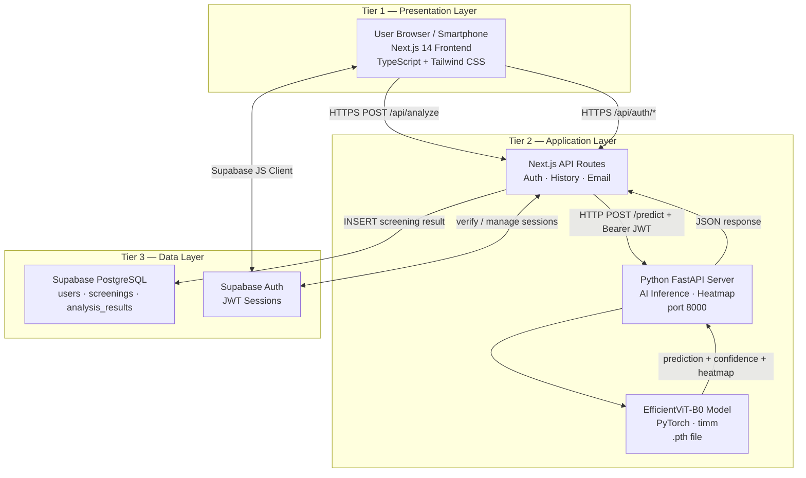
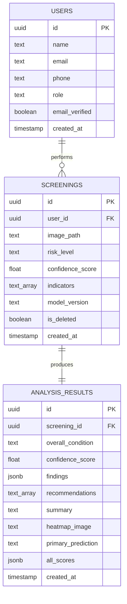
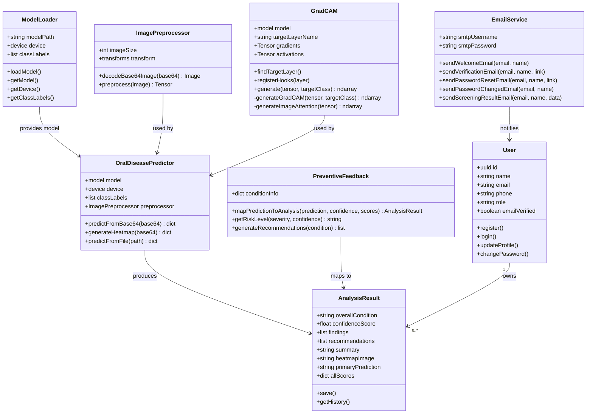
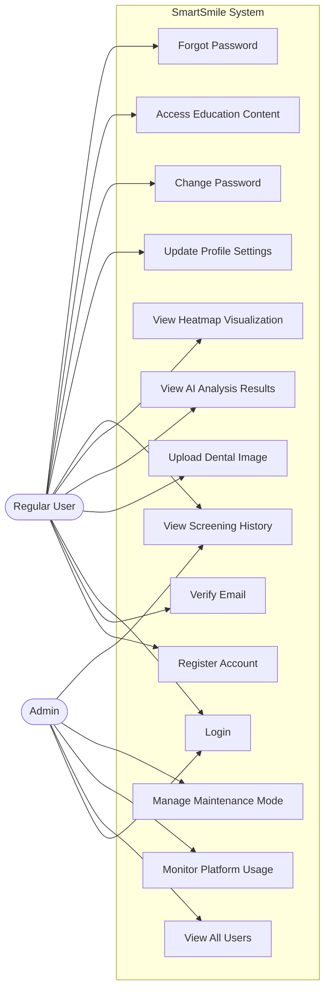
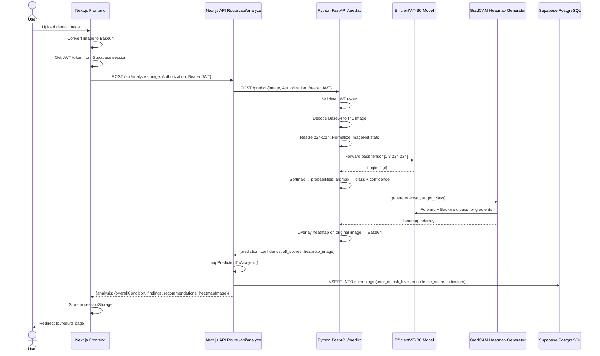
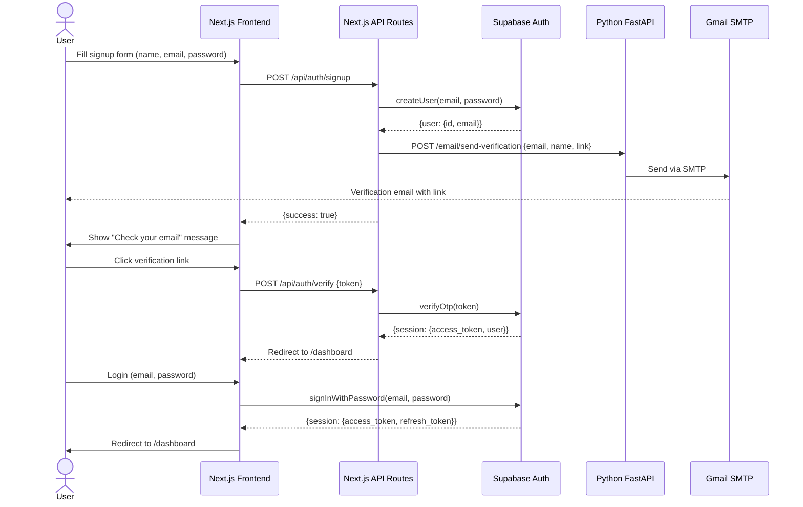

# SmartSmile — System Diagrams

> All diagrams are written in **Mermaid** syntax.
> To render them: open in VS Code with the "Markdown Preview Mermaid Support" extension, or paste any diagram into https://mermaid.live

---

## Diagram 1 — System Architecture (3-Tier)

---

## Diagram 2 — Entity Relationship Diagram (ERD)

---

## Diagram 3 — Class Diagram

---

## Diagram 4 — Use Case Diagram

---

## Diagram 5 — Sequence Diagram (Image Analysis Flow)

---

## Diagram 6 — Authentication Flow Sequence

